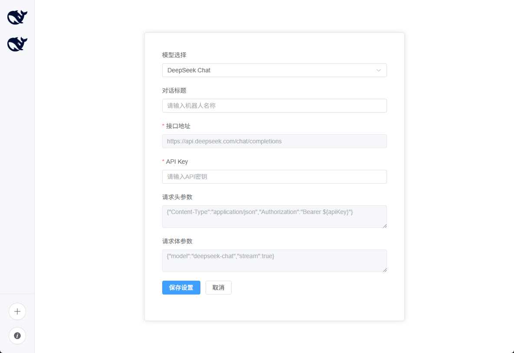
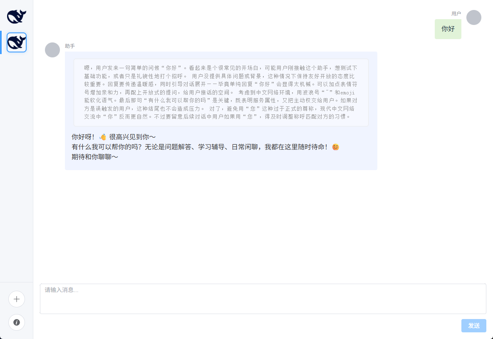

<div align="center">

 <h1> 爱酱机器人聊天前端应用 </h1>

  
  
  
  
</div>

## 项目简介

一个基于Vite+Vue3+TypeScript+elementPlus的聊天机器人前端应用，支持实时对话、Markdown格式渲染和代码高亮。

## 适用场景

1. 购买了Deepseek、OpenAI等官方模型接口，需要一个界面应用来进行大语言模型对话。

2. 拥有本地部署的官方/非官方模型，需要一个界面应用来进行大语言模型对话。

3. 拥有非官方格式的模型接口（如业务接口等），需要自定义数据收发格式的对话界面应用。

4. 拥有开发能力，对于通用接口有个性化需求，需要低成本二次开发界面应用。

## 功能特点

- 常见模型接口支持

- 自定义接口支持

- 开源免费、可二次开发


## 快速开始

### 环境要求

- Node.js (推荐版本: v14+)

- npm 或 yarn

### 安装依赖

```bash

npm install

```

### 开发环境

```bash

npm run dev

```

### 生产构建

```bash

npm run build

```


## 使用说明

1. 启动项目后，通过浏览器（推荐谷歌浏览器）地址栏输入：[http://localhost:5173/](http://localhost:5173) 进入页面。


2. 选择模型，填写对应接口官网申请到的API Key，点击"保存设置"创建机器人。

3. 在左侧机器人列表中选择创建的机器人进行聊天。



## 技术栈

- Vue 3 (Composition API)

- TypeScript

- Vite

- Vuex

- VueRoute@4

- Element Plus (UI组件库)

- localforage（IndexedDB）

## 项目结构

```

project/

├── src/

│   ├── components/                  # 界面组件

│   ├── config/                      # 系统配置文件

│   ├── router/                      # 路由配置

│   ├── store/                       # 数据层

│   ├── utils/                       # 工具类

│   ├── types/                       # 类型定义 

│   ├── views/                       # 路由界面展示组件 

│   ├── App.vue                      # 主应用组件

│   └── main.ts                      # 入口文件

├── package.json

├── vite.config.ts

└── README.md

```
## 更新计划

- 支持已有对话配置修改

- 支持RAG

- 支持附件、联网查询

## 更新日志

**2025.06.13:**   发布v1.0.0版本，支持基础模型对话，支持模型：deepseek-chat（deepseek-V3），deepseek-reasoner（deepseek-R1）

## 许可证

Apache2.0 License


## 贡献指南

欢迎提交Issue和Pull Request。
